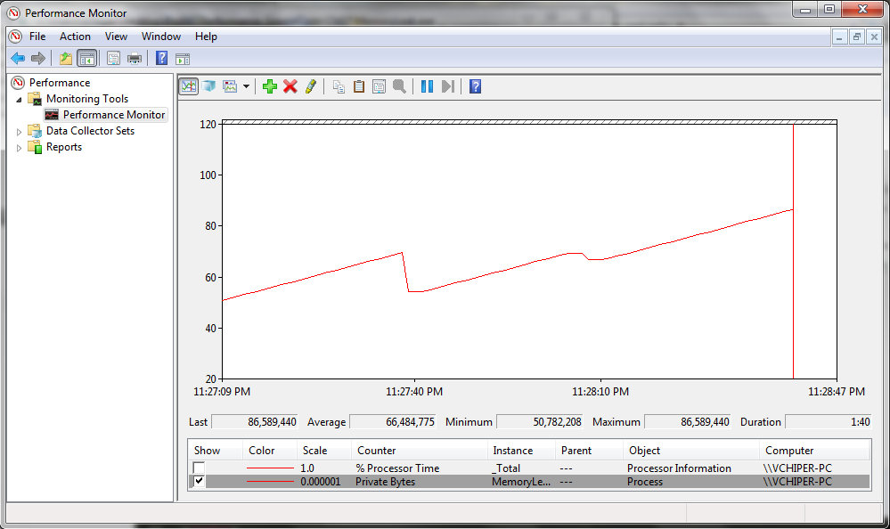
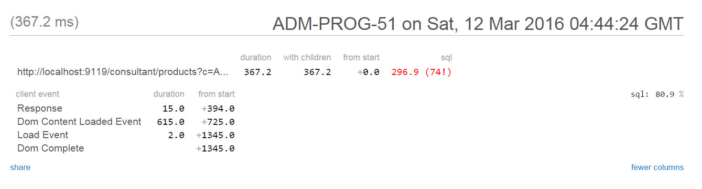
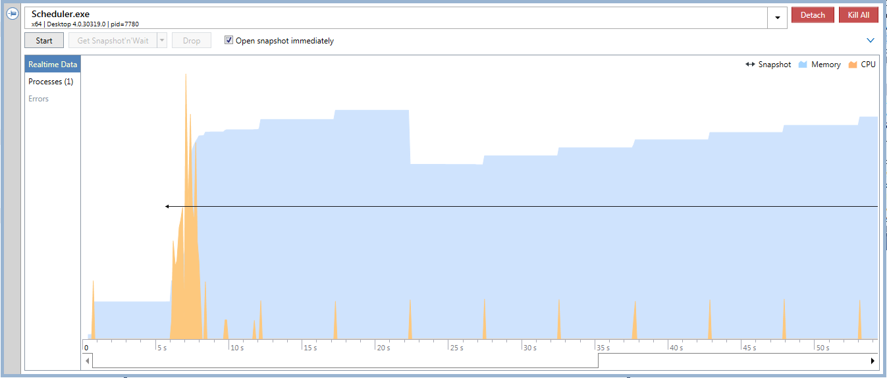
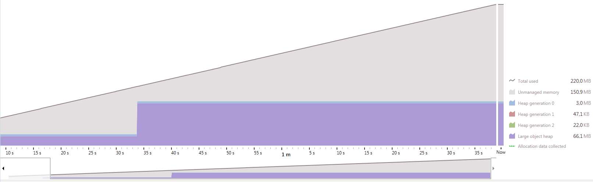

title: Оптимизация производительности .NET
author:
  name: Квачук Григорий
  url: https://vcipher.github.com/perf-talks
output: index.html
style: style.css
controls: false

--

# Оптимизация 
## производительности приложений на .NET

--

# С чего начать?

--

### Как выявить узкое место?

* Требования к производительности

* Характеристики производительности

--

### Требования (неправильные)

* Высокая отзывчивость при одновременном доступе нескольких пользователей.

* Низкий объем потребления памяти при небольшом количестве посетителей.

--

### Требования (правильные)

|               |                                                       |              |
|---------------|-------------------------------------------------------|--------------|
| Веб-сервер    | Время на обработку запроса не более 300 мс            | Одновременно не более 300 запросов в секунду
| Клиентское приложение | Время запуска не должно превышать 1500 мс     | 8 Гб оперативной памяти
| Клиентское ПО | Нагрузка на ЦП в режиме простоя не должна превышать 1% | Процессор Intel Core i7 4790 3,6 ГГц или AMD FX-9590 4,7 ГГц 

--

### Характеристики

|                     |       
|---------------------|--------------------------------------------------
|Нагрузка на CPU      | %
|Использование памяти | Килобайты, мегабайты, гигабайты
|Время выполнения     | Миллисекунды
|Сборка мусора        | Продолжительность % от общего времени выполнения
|Попадания в кэш      | Количество попаданий в секунду

--

### Производительность в цикле разработки ПО

* Выделение требований по основным характеристикам производительности

* Тестирование прототипов на этапе разработки

* Нагрузочное тестирование системы перед каждым новым релизом

--

# 
## Построение догадок и преждевременных выводов о производительности приложения -
## **это самое худшее, что может сделать разработчик**

--

### Подходы к измерению производительности

* Счетчики производительности (performance counters)

* Профилировщики времени

* Профилировщики памяти

* Микрохронометраж (microbenchmarking)

-- image-page

### Счетчики производительности



--

### Счетчики производительности

```java
public class Program
{
    // Создание категории счетчика
    public static void CreateCounterCategory()
    {
        if (PerformanceCounterCategory.Exists("MyUsers"))
            PerformanceCounterCategory.Delete("MyUsers");

        CounterCreationDataCollection counters = new CounterCreationDataCollection
        {
            new CounterCreationData("# Пользователи онлайн", "Количество пользователей в приложении",
                PerformanceCounterType.NumberOfItems32)
        };

        PerformanceCounterCategory.Create("MyUsers", "Информация о пользователях онлайн", counters);
    }

    // Метод запуска счетчика
    public static void StartUpdatingCounters()
    {
        PerformanceCounter usersAtWork = new PerformanceCounter("MyUsers", "# Пользователи онлайн", false);

        Timer updateTimer = new Timer(_ => usersAtWork.RawValue = MyUsers.UsersCount, 
            null, TimeSpan.Zero, TimeSpan.FromSeconds(1));
    }
}
```
--

### Профилирование времени

StackExchange MiniProfiler [http://miniprofiler.com/](http://miniprofiler.com/)

JetBrains dotTrace [https://www.jetbrains.com/profiler/](https://www.jetbrains.com/profiler/)

-- image-page

### Профилирование времени (MiniProfiler)



-- image-page

### Профилирование времени (dotTrace)



-- image-page

### Профилирование памяти (dotMemory)



--

### Микрохронометраж (microbenchmarking)

```java
public void Main()
{
    var sw = Stopwatch.StartNew();

    TestMethod();

    Console.WriteLine(sw.Elapsed);
}
```


[https://github.com/PerfDotNet/BenchmarkDotNet](https://github.com/PerfDotNet/BenchmarkDotNet)

-- microbenchmark

### Микрохронометраж (microbenchmarking)

```ini
OS=Microsoft Windows NT 6.1.7601 Service Pack 1
Processor=Intel(R) Core(TM) i5-4440 CPU @ 3.10GHz, ProcessorCount=4
Frequency=3026523 ticks, Resolution=330.4122 ns
HostCLR=MS.NET 4.0.30319.42000, Arch=32-bit RELEASE

```
| Коллекция  |  Среднее        |  Разброс    |
|----------- |---------------- |------------ |
|      Array |   323.1913 мкс  |  4.0372 мкс |
| LinkedList | 2,354.5558 мкс  | 26.8252 мкс |

--

### Нагрузочное тестирование

